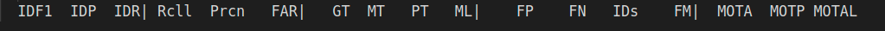

# HSL-interview

## Setup guide

Please refer to [Setup-and-Run-guide](./PVT/README.md) for details


## Output Videos note:

The sample videos are Here:


https://drive.google.com/drive/folders/1rSUEbi-ZsMgLg4ydVwZE-F7fRrP7yzzf?usp=sharing

_(It's probably quite hard to visualize in Google Drive preview mode, please download to see in full resulotion)_

The float in their names are the confidence thresholds used during the inference.

The green/blue boxes are detections with each color representing a object identity (for visualization).

The different colors of Red boxes are Ground Truth.

The id and class are also labeled but probably too small to view


## Settings

### datasets

All datasets are mapped to three classes:

```
Other(0), Person(1), Vehicle(2)
```

specificially, for VisDrone:

Class | mapped Class
--- | --- 
[0, 11] | 0 
[1, 2] | 1
[3...10] | 2


and for COCO:

Class | mapped Class
--- | --- 
[0] | 1
[2,3,4,6,8] | 2
others | 0

### Models

Most experiments are run on **ResNet-50-FPN** although some did test with ResNext-101-FPN


## Metrics

### MOT metrics

The best settings in Ablation studies are used , **without** changing the kalman filter weight. 


This is the metrics across all videos in the test-dev dataset of VisDrone


### mAP


### FPS
Average FPS = 3.726183396757731
vs
Vanilla FPS = ~22

The low FPS is due to the fact that deepsort is mainly run on CPU with numpy and constant data exchange between cuda and cpu. 


## Ablation Studies

NOTE: due to my not-so-good machine and my poorly optimization of deepsort integration, the test dataset takes 30-40 min to finish. So I picked two most represetative videos from test dataset. One is stable and mostly people and the other is high above ground with a frequent turning camera, and consists of mostly vehicles.


### mAP, detection object size and OD stuff.

The angle of VisDrone is a little different from the images from COCO, which is the training dataset of MAL. As most coco are taken stationary from the ground. VisDrone are almost always above the object, making it harder to detect some objects, such as the top-back of the trucks. Furthermore, most images in VisDrone is taken in urban area, containing small crowds (people) and vehicle that the model find it hard to recognize. The model has a higher AP in large objects than that in smaller ones.

for example the red crowd in the middle:


### confidence threshold

One of very important metrics, MOTA performs poorly in crowded areas with default settings, which threshold the minimum confidence to 0.3.

However, this is due to the very high amount of false positives, so increasing the threshold helps a lot with false positives until it reached to about 0.8, where the true positives started to drop significantly.

Noted this would, as expected, increase the number of missing items. So picking the confidence threshold is more of a case-to-case setting.

At the end, in terms of MOTA, 0.75 performs best across most videos.


### Resolution/FPS


**NOTE**: Other parameters has little affect on FPS/tracking time in my experiment

I experimented resolution of [1, 0.75, 0.5 0.25, 0.1]. 

Both the MOT and mAP metrics went down as the resolution gets lower, which is expected.

 However, the FPS was improved but not significantly. I believe the bottleneck of FPS is not deepsort algorithm but the migrition of data from cuda to cpu,  accomendating the numpy arrays which used in calculations in deepsort. (avg. ~0.15 sec used in deepsort.update)

 Also, when the resulotion is extremely small, deepsort has hard time processing it. I think it is due to many overlapped bounding box at smaller resulotions.




### Bigger Model sizes

This is pretty much what expected - larger model comes with better detection results but slower fps


### Number of proposals

In low confidence thresholds, choosing a low number of proposals from the model can act as a sort-of high confidence threshold, which significantly reduce false positives.


While on the other hand, for higher confidence threshold, lower numbers of proposals become limiting factors, and increasing the number have slight/none improvement (compare to default of 1000):


### Kalman Filter weight thrsholds

changing these weights in kalman filting:

```python
self._std_weight_position = 1. / 20
self._std_weight_velocity = 1. / 160
```

#### why bother?

Quote from someone who was really famous but not so well-known for me to remember the name:
```
Scientific inquiry starts with observation
```


The first thing that one may notice in the videos in VisDrone is rapid turn of the camera.

The quick camera shift in some videos is too quick for Kalman Filter in DeepSort and thus it filter them out. Later when the frames are stable it thinks it is an new object after the camera shift, resulting a large number of wrong id assignments.


Choosing large weights(thresholds) can relief that problem by increase the tolerance of Kalman Filtering, as shown in the gif below:


**However, it comes with a price---metrics are lower, showing more false positives are detected.**


### Other parameters to relief the condition:


Some parameters that help improve the model while have little/none negative affect:

```python
# The distance threhold , increase tolerance while only have slight/none impact on the metrics
  MAX_DIST: 0.25 # default -> 0.2


# in retinanet/deep_sort_pytorch/deep_sort/sort/nn_matching.py : _nn_cosine_distance ()
# averaging the distance to increase tolerance
# almost always give better MOTA results while decrease very slight MOTP

  distances.sort(axis=0)    # sorted firstly
  return distances[1:5].mean(axis=0)  #average  2-5  features

  # return distances.min(axis=0)

```

experiment results:


Updated: More detailed ablation study on distance averaging:


